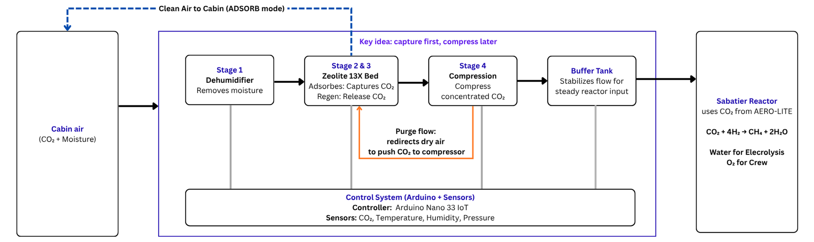
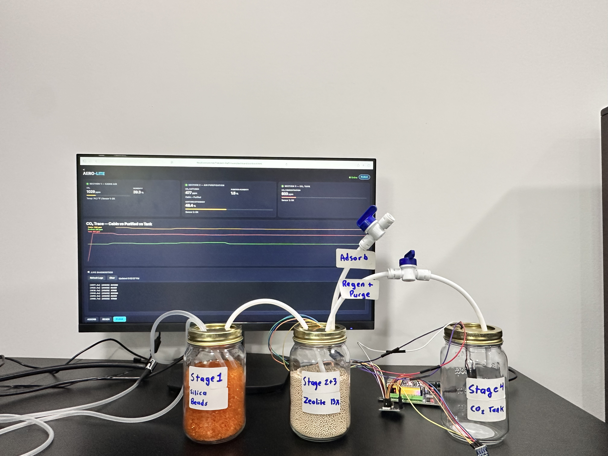

# AERO-LITE

**A regenerative CO₂ life support preprocessor built by a high school freshman.**

Designed for NASA's Carbon Capture Challenge. Engineered for long-duration lunar habitation.

---

## The Problem

When astronauts spend 6 months on the Moon, they cannot rely on existing systems designed for the ISS.

- **CDRA** — the ISS workhorse — draws 600 watts and weighs **661 pounds**. It vents captured CO₂ into space. That works on the ISS, but the Moon has no "into space." You are in a sealed habitat.
- **LiOH canisters** — the backup — are single-use. For a 180-day Artemis stay, a 4-person crew would need **1,440 canisters**. That is **6,349 pounds** of dead weight. The math does not close.

NASA needs something regenerative, lightweight, and maintainable without resupply. That is what I set out to build.

---

## Why I Built This

The more I read about Artemis, the clearer the constraints became. No resupply. No airlock dumps. Every watt and every ounce matters.

NASA has a CDRA that captures CO₂. NASA has a Sabatier reactor that turns CO₂ into water and oxygen. But the CDRA outputs wet, low-pressure gas mixed with cabin air. The Sabatier requires dry, concentrated, pressurized input. The handoff between them is inefficient.

I asked whether a smaller, simpler front-end could bridge that gap. Not to replace NASA's work, but to understand the problem by solving a piece of it.

That is how AERO-LITE started.

---

## What It Does

AERO-LITE is a four-stage preprocessor that conditions CO₂ for the Sabatier reactor:

1. **Dry the air** — silica gel strips moisture so zeolite can adsorb efficiently
2. **Trap CO₂** — zeolite 13X bed captures CO₂ at room temperature
3. **Release it** — heat to 248°F and concentrated CO₂ desorbs
4. **Compress and buffer** — steady 22 psi feed for the reactor

The insight: do not simply remove CO₂. Condition it into feedstock the next stage requires.



_Four stages. One physical zeolite bed. Two operating modes. The ESP32-S3 controller cycles automatically between ADSORB (~80% of cycle, clean air returns to cabin) and REGEN/PURGE (~20% of cycle, concentrated CO₂ flows to the Sabatier)._

### Phase 1 Prototype



## _Three-stage glass jar prototype with live ESP32-S3 dashboard. Stage 1: Silica gel dehumidifier. Stage 2+3: Zeolite 13X capture/regeneration bed. Stage 4: CO₂ buffer tank. The web interface shows real-time CO₂ concentration, humidity, and system state._

## Technical Depth

This is not a kit. I designed, modeled, and integrated every subsystem.

### Systems Engineering

I started by quantifying the alternatives. LiOH canisters for a 180-day Artemis stay would require **1,440 units weighing over 3 tons**. The CDRA works on the ISS but draws **600 watts** and weighs **661 pounds**. Neither scales to the lunar surface.

I optimized for mass before features because every pound to the Moon costs thousands of dollars to launch.

### Chemistry & Materials

I chose **zeolite 13X** over activated carbon because its 10-angstrom pores and cationic sites bind CO₂ strongly even in humid cabin air. Activated carbon preferentially adsorbs water and collapses CO₂ efficiency.

I rejected pressure-swing regeneration (vacuum seals are catastrophic leak risks in microgravity) in favor of **thermal swing** with a self-limiting PTC heater and a bimetallic hardware failsafe that works even if the microcontroller crashes.

---

## Iteration & Failure

I document what broke because that is where learning happens.

**Phase 1 — May 2026 (Competition Sprint)**  
Functional prototype with LED-simulated heater. Validated airflow paths, state machine timing, and sensor telemetry. I initially assumed compressing cabin air directly was simpler. Running the numbers showed **99% of that energy compresses nitrogen**, not CO₂. I redesigned to concentrate first, compress second.

**Phase 2 — Planed (Thermal Validation)**  
Add 248°F thermal desorption under supervised conditions. Measured actual CO₂ breakthrough curves against published zeolite data. Confirmed ~90% capture efficiency at tested flow rates.

---

## Repo Structure

```
/aero-lite/
├── README.md                 # You are here
├── competition/              # NASA Challenge submission (May 2026)
│   └── presentation/
├── docs/
│   ├── system-architecture.md   # Technical deep-dive
│   └── design-decisions.md      # Trade-off analysis
├── media/
│   ├── system-architecture.png
└── LICENSE                   # MIT
```

---

## Contact

**Tilak Patel**  
8th Grade, Thompson Middle School
Incoming Freshman, St. Charles North High School
[Email](mailto:iamtilakpatel@gmail.com)

---

## License

[MIT](LICENSE) — Tilak Patel, 2026

---

_AERO-LITE was developed as part of the NASA Space Center Houston Carbon Capture Challenge, Spring 2026._
